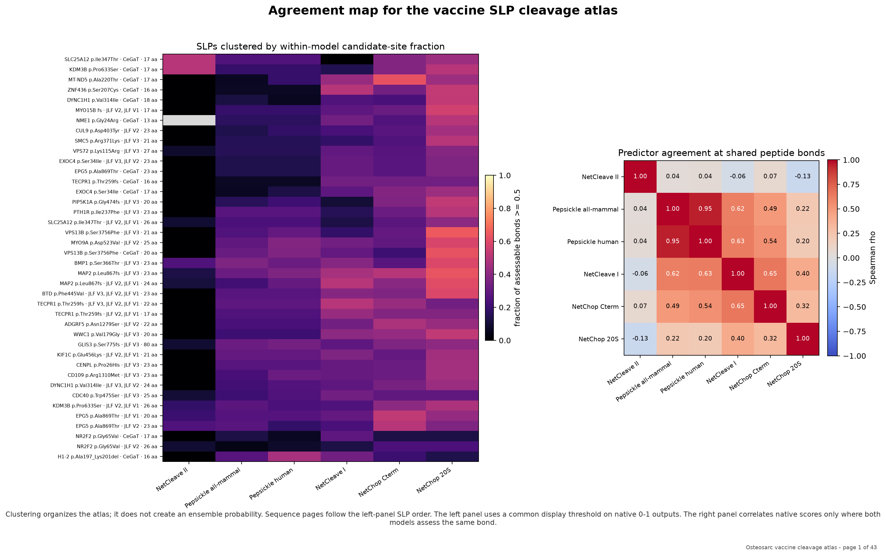

# Osteosarc vaccine cleavage analysis

Source snapshot: osteosarc.com repository `deaf7290a5dfa9d8d7c8ab9da5d001f69fcc2d47` (2026-09-15T05:35:02-04:00).
All inference was local; no peptide sequence was uploaded.

## Coverage

- 78 disclosed sequence records (77 unique sequences).
- 40 disclosed synthetic-long-peptide records (39 unique sequences).
- 33 vaccine-target assignments have no vaccine-specific sequence disclosed on the site.
- 1 identical-sequence/across-variant provenance conflict was detected.

The inventory distinguishes mRNA encoded contexts, displayed mRNA minimal epitopes, and SLPs. Only SLP records are included in the cleavage tables and figures.
The compact [SLP-by-predictor matrix](tables/slp_predictor_matrix.csv) and exact [bond-level scores](tables/slp_quantitative_bond_scores.csv) are provided separately.

## Sequence cleavage atlas

The [complete PDF atlas](all-figures.pdf) places every quantitative score and motif-rule match at its exact peptide bond. It contains one clustered overview followed by one page per SLP (with the 80-aa outlier split across three continuation pages). [Atlas order and PDF page numbers](tables/atlas_sequence_order.csv) are provided for navigation.

The overview clusters predictors using Spearman correlation of native scores at shared, assessable bonds. It clusters SLPs using standardized within-model fractions above the 0.5 display threshold. Clustering is organizational only and is not an ensemble model.

## Quantitative model output distribution

The 0.5 cutoff is used only as a within-model display threshold. It is not a calibrated probability of SLP degradation, and fractions must not be compared as if the models shared a scale.

| Model | SLP records assessed | Median fraction ≥0.5 | Range |
| --- | ---: | ---: | ---: |
| netchop-3.1-20s-3.0 | 40 | 0.452 | 0.125–0.650 |
| netchop-3.1-cterm-3.0 | 40 | 0.318 | 0.125–0.625 |
| netcleave-i-hla | 40 | 0.304 | 0.000–0.500 |
| netcleave-ii-hla | 39 | 0.000 | 0.000–0.500 |
| pepsickle-in-vivo-all-mammal | 40 | 0.222 | 0.040–0.364 |
| pepsickle-in-vivo-human-only | 40 | 0.240 | 0.059–0.467 |

NetCleave-I uses an 8-residue peptide ending at each candidate bond plus three downstream residues. NetCleave-II uses a 13-residue ending peptide plus the same three-residue downstream context; bonds lacking that context are not assessed.

## Quantitative peptidase outputs without a binary threshold

These native scores have no validated common cutoff and are therefore not included in the ≥0.5 figure. Their scales are model-specific.

| Model | SLP records assessed | Native-score range |
| --- | ---: | ---: |
| dpp4-qpisa | 28 | -0.5799–3.4261 |
| eramer-step | 4 | -0.1818–0.0946 |

## Motif matches

Counts below are matched recognition sites across all disclosed SLP records. Required, preferred, and permissive rules have different meanings; see `model_catalog.csv` and the project cleavage guide before interpreting a match.

| Motif model | Total matched sites |
| --- | ---: |
| mme-hydrophobic | 157 |
| ace-dipeptidyl | 36 |
| prep-pro | 36 |
| tpp2-tripeptidyl | 34 |
| npepps-n-terminal | 26 |
| cpb2-basic | 17 |
| cpn-basic | 17 |
| erap2-basic | 12 |
| anpep-ala | 4 |
| app1-xp | 4 |
| app2-xp | 4 |
| dpp8-xp-xa | 4 |
| dpp9-xp-xa | 4 |
| fap-dipeptidyl | 3 |
| fap-endo-gp | 3 |
| enpep-acidic | 1 |

## Interpretation boundary

- Proteasome results are conditional on cytosolic access. An injected SLP ordinarily begins outside the cytosol; these scores do not predict uptake or cross-presentation.
- NetCleave-II is an MHC-II C-terminal-processing model, not a named-cathepsin model. Its published class-II discrimination is much weaker than its class-I result.
- Peptidase motif matches describe partial recognition rules on an intact peptide with free termini. They do not model abundance, activation, competition, ordered digestion, kinetics, formulation, structure, or MHC protection.
- ERAMER is evaluated only where the intact SLP is inside its documented 9–16-residue domain. It is an ERAP1 trimming score, not a whole-SLP degradation score.
- Missing sequences and the cross-variant duplicate are left visible. No sequence was guessed, corrected, or reassigned.
