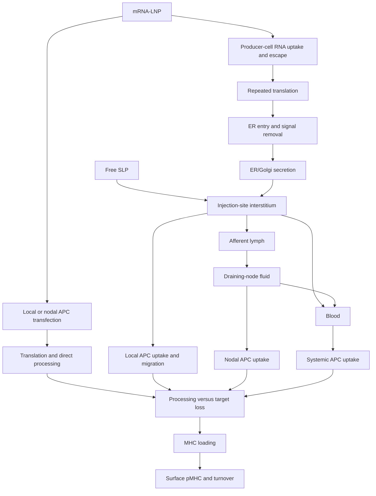

# SLP and mRNA trajectories to APC pMHC

**Follow the chosen target until loading, then report surface pMHC.** Parent
disappearance, target destruction, uptake, loading and display differ.
`simulate_vaccine_trajectory` combines mechanisms for **local IM/SC free SLP
versus secretion-tagged mRNA-LNP**. It is an explicitly parameterized scenario
model with no physiological rate defaults. Missing reachable kinetics yield
`unassessed` and no numerical curves.

## Branching routes



Local antigen need not enter blood before nodal presentation. Lymph entry,
vascular absorption, local uptake and loss compete. Local APCs can carry RNA,
antigen or pMHC into nodes. `systemic` APCs pool blood-accessible uptake separately
from draining-node APCs. Carrier and antigen drainage have separate rates.
IM and SC share topology but need tissue-, material- and study-specific rates.

## Included steps and required assumptions

| Stage | Included mechanism | Required input/assumption |
|---|---|---|
| Free SLP | Starts in injection-site interstitium | Released free canonical L-peptide; no depot/attachment. Other formulations need a release/binding model |
| mRNA delivery | Producer-cell/APC uptake, carrier drainage, nodal APC uptake, RNA escape versus loss | Rates for actual LNP and route. Carrier arrival does not establish cytosolic RNA |
| Expression | RNA decay and repeated completed antigen synthesis | Antigen birth per active transcript; RNA is not consumed. No codon/UTR or translation-delay prediction |
| Secretory routing | ER entry plus signal removal, ER/Golgi secretion, failed entry, APC ER retrotranslocation, secretory loss | Full translated construct and signal boundary. Secretion competes with direct APC processing |
| Secretory processing | Supplied current-fragment cuts during secretory ER/Golgi residence | Convertase or other processing needs its own applicable hazard; no inferred activity from signal targeting |
| Extracellular | Interstitium, afferent lymph, node fluid, blood; transport, uptake, cuts, clearance | Separate current-fragment kinetics in each compartment; no serum-to-blood/lymph default |
| APC migration | RNA, antigen or pMHC carried from local APCs to nodes | Effective rates; no separate recruitment, subsets or survival dynamics |
| MHC-I | Endosomal escape, cytosolic cuts, TAP, ER N-terminal trimming | Supplied hazards/TAP length bound; complete target C-terminus before TAP, exact ligand before loading |
| Alternative MHC-I | Exact-ligand vacuolar loading | Independently enabled/disabled |
| MHC-II | Endolysosomal cuts, optional intracellular routing to endolysosomes, target-containing ligand loading | Explicit ligand length bound and exact core/span/mutation mapping |
| Loading | Loading versus destruction/disposal | Effective allele/ligand/APC rate; loading machinery, groove availability and MHC-II CLIP/DM editing are lumped |
| Display | Surface export, pre-surface loss and surface turnover | Bound target leaves free-peptide cleavage; complex loss has its own rate |

A human DC experiment supports proteasome/TAP-dependent presentation of a
Melan-A SLP ([study](https://doi.org/10.1371/journal.pone.0089897)). A mouse OVA
experiment supports CatS/TAP-independent presentation with phagocytic stimulation
([study](https://pubmed.ncbi.nlm.nih.gov/25378230/)). These establish scoped
mechanisms, not universal probabilities.

Secretion-tagged RNA produced serum antigen in an intravenous mouse RNA-LPX
experiment ([study](https://doi.org/10.1038/s41598-017-11399-3)); this does not set
local mRNA-LNP rates. **Cross-dressing**, transfer of preformed pMHC from other
cells, is excluded from this first model. It contributed to priming in a recent
mouse mRNA-LNP experiment ([study](https://pmc.ncbi.nlm.nih.gov/articles/PMC13089314/)).

The chosen mRNA target must lie entirely **after the supplied signal boundary**.
Signal removal does not necessarily destroy a target inside the released leader;
signal-derived epitopes can be presented ([primary experiment](https://pubmed.ncbi.nlm.nih.gov/7595234/)).
Their membrane processing and presentation are outside this model, so overlapping
targets are rejected rather than labeled destroyed.

## Which peptidases matter in lymph?

**Separate free fluid, lymphatic/tissue surfaces and enzymes inside APCs.**
There is no universal lymph-to-blood cleavage multiplier.

| Evidence | Interpretation |
|---|---|
| Soluble **DPP4**: measurable, lower-than-plasma activity in mouse mesenteric lymph; inhibitor-sensitive GLP-1 loss | Separate lymph channel if applicable rates exist; no human SLP transfer |
| Surface **DPP4**: higher enzymatic activity in cultured human dermal lymphatic versus blood endothelium | Wall contact differs from free-fluid exposure |
| Tissue processing: human pre-nodal lymph carries matrix/tissue fragments; tissue-processed lymph antigens contribute to MHC-II ligands | MMP/ADAM and other upstream processing can matter. Products do not prove active enzymes in sampled fluid |
| **Cathepsins/AEP** after uptake | Intracellular endolysosomal processing, with pH, cell subtype and activation limits |
| **FAP, MME, ACE** and other extracellular candidates | Conditional recognition/location evidence; reviewed sources do not identify general human-lymph SLP hazards or strength rankings |

Sources: [mouse soluble DPP4](https://pmc.ncbi.nlm.nih.gov/articles/PMC4054822/),
[human endothelial DPP4](https://doi.org/10.1016/j.yexcr.2008.07.024),
[human lymph peptidome](https://doi.org/10.1371/journal.pone.0009863),
[lymph-derived MHC-II ligands](https://doi.org/10.1074/jbc.M115.655738).
The DPP4 paper's abstract/results contain different lymph activity summaries;
both are retained in `vaccine_trajectory_evidence()`. Units are
pmol/min/microliter, not inverse-hour vaccine cleavage hazards.

Albumin-binding amphiphile experiments show formulation-dependent drainage and
presentation duration; those are not free-SLP defaults
([study](https://pmc.ncbi.nlm.nih.gov/articles/PMC6247902/)). The
[serum audit](serum-calibration.md) also found no transferable vaccine-fragment
calibration. Serum is ex vivo; `blood` here needs applicable in vivo rates.

## Kinetic contract

`vaccine_route_steps(delivery, mhc_class)` lists steps and rate keys. Every
`VaccineRate` has `value_per_hour`, `basis` (`measured`, `assumed`, `disabled`,
`unassessed`) and `source`. Missing is unknown. Zero requires an explicit
assumption/exclusion; it is not inferred protection.

The cleavage callback receives compartment and **current** `TargetFragment`
in original-parent coordinates. Return `VaccineCleavageRates` containing absolute
`EnzymeCutRate` channels and provenance, or `None` for missing kinetics. Empty
channels need a no-cut assumption. Reassess newly exposed termini. Flank/boundary
cuts preserve the target; internal cuts destroy its exact span.

Transport, uptake and loading use one supplied rate per compartment/step across
eligible fragments. Only cleavage is fragment-specific in this first model.
MHC-II ligand eligibility does not imply equal biological loading kinetics; the
common rate is a scenario assumption that can be compared in separate runs.

NetChop, Pepsickle, NetCleave-II, cathepsin matrices, DPP4 assay depletion, MMP
scores and recognition rules remain evidence, not hazards/loading rates. Prefer
human Pepsickle for human input; all-mammal is a separately labeled alternative
when organism exposure warrants it. Existing
[target-degradation](target-degradation.md) estimators can supply separate,
explicitly transferred sensitivity scenarios. Do not average estimators or
label transfers calibrated blood/lymph kinetics.

## Outputs and interpretation

- `extracellular_parent_copies`: intact free SLP or mature secreted antigen.
- `extracellular_target_copies`: exact target in any extracellular fragment.
- `cumulative_loaded_copies`: ever loaded, without recounting APC migration.
- `surface_pmhc_copies`: current display with local/node/systemic totals.
- `target_destroyed_copies`, `antigen_cleared_copies`, `pmhc_lost_copies`: distinct outcomes.
- `antigen_balance_error`: supplied/translated antigen minus retained/lost antigen.

The nonnegative exponential solver follows a linear, first-order, time-invariant
expected-copy system. Translation is antigen birth. SLP starts with peptide
copies; mRNA starts with carrier-bound transcripts and can produce many antigens.
**Raw yields are not equal-dose efficacy or comparable probabilities.** Each
exact target occurrence produces at most one modeled pMHC per antigen copy.
Different alleles/targets and MHC-II core/flank mutations need separately mapped runs.

Excluded: whole-body PBPK, sequence-derived delivery, folding/glycosylation/binding,
cell-subset dynamics, MHC saturation/competition, cross-dressing and immune response.
Every result preserves exclusions and primary-source evidence. Sensitivity ranges
are not biological confidence intervals. Tests validate equations/bookkeeping,
not human presentation accuracy.

## Reproduce synthetic examples

```sh
python scripts/vaccine_trajectory_example.py --output /tmp/vaccine-trajectories
mhctools vaccine-trajectory \
  --input /tmp/vaccine-trajectories/slp-input.json \
  --output /tmp/slp-recomputed.json
```

The script writes inputs, outputs and a readable SLP/mRNA comparison. **Every
numerical value is synthetic, not a Sid forecast.** CLI inputs include
`schema_version: 1`, model fields, `times_hours`, and `cleavage_assessments` indexed
by compartment and original `[start,end)` interval, including exact sequence,
channels, basis and source. Outputs are never overwritten. This complements the
evidence-oriented [`target-summary.json`](vaccine-target-summary.md) without
inventing missing inputs.
